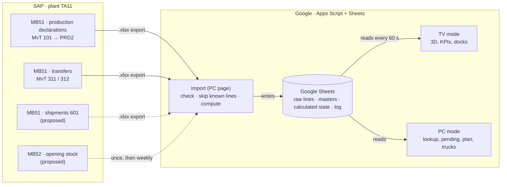
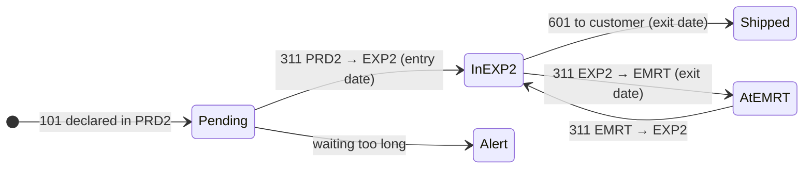

# EXP2 Digital Twin · WMS_exp_zone

A digital twin of the **EXP2 finished-goods warehouse**, built only with **Google Apps Script** (web app) and **Google Sheets** (database), fed by **SAP extractions**. It shows on a wall TV and on office PCs what is in the warehouse, where, since when, what is still waiting in production, and how full the racks and the shipping docks are.

**Status:** design phase (phase 0). The plan, the simulated database and the screen mockups are ready; no application code yet.

| | |
|---|---|
| **Stack** | Google Apps Script (HtmlService web app) + Google Sheets. No server, no paid service. |
| **Input** | SAP MB51 exports (production declarations, transfers), uploaded from the PC page. No live SAP link. |
| **Warehouse** | EXP2, about 1,600 m², 8 storage blocks (1,464 pallet places assumed), 8 shipping docks. |
| **Screens** | TV (3D view, key numbers, docks) and PC (lookup, pending, 2D plan, trucks, import). |
| **Documents** | [Implementation plan](docs/IMPLEMENTATION_PLAN.md) · illustrated plan (link added after publishing) · [Sample database](sample-data/README.md) |

---

## En bref (français)

- **Quoi :** un jumeau numérique de l'entrepôt d'expédition **EXP2**, sur Google Apps Script + Google Sheets uniquement.
- **Données :** les extractions SAP **MB51** (déclarations de production 101 → PRD2, transferts 311 PRD2 → EXP2 / EXP2 ↔ EMRT) sont importées depuis la page PC. Pas de lien direct avec SAP.
- **Logique :** déclaré mais pas encore en EXP2 = **en attente** ; transféré en EXP2 = **en stock**, avec date d'entrée, âge et emplacement ; sorti (601 ou 311 vers EMRT) = **sorti**, avec date de sortie.
- **Écrans :** une **TV** (vue 3D, saturation des blocs, quais et camions, alertes) et des **PC** (recherche article, en attente, plan 2D, quais & camions, import).
- **À faire maintenant :** répondre aux [questions ouvertes](docs/IMPLEMENTATION_PLAN.md#12-open-questions-most-important-first) et fournir un export réel d'une journée.

---

## Contents

1. [How it works](#how-it-works)
2. [Key concepts](#key-concepts)
3. [Screens](#screens)
4. [Features and roadmap](#features-and-roadmap)
5. [Repository structure](#repository-structure)
6. [Simulated database](#simulated-database)
7. [Data needed from SAP](#data-needed-from-sap)
8. [Development workflow (planned)](#development-workflow-planned)
9. [Glossary](#glossary)

---

## How it works



1. Someone exports the SAP lists and drops them on the **Import** page.
2. Apps Script reads the files in the browser, checks them, skips lines already in the database, and recalculates the state of EXP2 once.
3. The TV and the PCs only read that small calculated state, so they stay fast. Every screen shows **"Données SAP du …"** so everyone knows how fresh the twin is.

## Key concepts

**Storage locations (Magasin):** `PRD2` = production · `EXP2` = our warehouse, the twin · `EMRT` = external warehouse.

**Pallet status**, derived only from SAP lines:



- **MB51 has no pallet number.** The twin builds **virtual pallets**: quantity ÷ quantity per pallet (from the `ARTICLES` tab), rounded up per entry.
- Entries and exits are matched **oldest first (FIFO)**, which gives every remaining quantity an **entry date**, an age and, when it leaves, an **exit date** and dwell time.
- A **311 transfer is two SAP lines** with the same document number: minus in the storage location it leaves, plus in the one it enters.
- **Reversals** (102, 312, 602) cancel the latest posting of the same article.
- **Placement** (which block a pallet is in) will follow the rules you provide; until then a placeholder maps product family → block.

## Screens

| Screen | For | What it shows |
|---|---|---|
| **TV · overview** | Wall screen, no mouse | 3D warehouse with pallets per block, pending pallets at the conveyor, saturation per block, trucks at the 8 docks, key numbers, alert ticker |
| **PC · Recherche article** | Office | One article: pallets in EXP2 / PRD2 / EMRT, entry dates and ages, exits with dwell time, SAP lines, location |
| **PC · En attente** | Office | Declared in PRD2, not yet in EXP2, oldest first |
| **PC · Plan 2D** | Office | Plan to scale colored by rack saturation; click a block to see its content |
| **PC · Quais & camions** | Shipping team | The 8 docks: truck, status, loaded / planned pallets, dock staging saturation |
| **PC · Import** | Admin | Drop SAP files, see the checks, save; import log |

Mockups of all of them are in the illustrated plan (link added after publishing).

## Features and roadmap

| Phase | Content | Done when |
|---|---|---|
| **Phase 0** **(in progress)** | Clarify: Answer the questions at the end of this page.; Export one real day of each file (names can be hidden), plus one MB52.; Confirm the blocks: names, levels, capacity. Start the `ARTICLES` list.; One test on the TV hardware: the 3D view, the CDN libraries and the link access. | A real export imports into the sample structure with no manual fix, and the 3D test runs on the TV. |
| **Phase 1** | Data foundation: The spreadsheet and the two Apps Script projects (code in this repo).; The import page: reading, checks, replacing days, import log.; The calculations: stock per storage location, pending, FIFO dates, virtual pallets, daily figures.; Freshness stamp and the first alerts (unknown article, negative stock). | On a given day, EXP2 stock in the twin equals SAP MB52 for EXP2, article by article (every gap explained). Re-uploading a file changes nothing. The sample database gives exactly its `CALC_*` tabs. |
| **Phase 2** | PC: lookup, pending, 2D plan, saturation: Pages: Recherche article, En attente, Plan 2D.; Your placement rules replace the placeholder.; Rack saturation per block and overall. | Any article found in under 10 s with its entry dates. The saturation of 2 blocks matches a physical count within ±5 %. |
| **Phase 3** | 3D and TV mode: The 3D view from the `LAYOUT` tab, with gentle rotation.; The TV layout with rotating scenes and auto refresh.; Kiosk setup on the TV PC. | The TV runs 5 working days unattended and shows a new upload within 1 minute. |
| **Phase 4** | Docks and trucks: The `QUAIS_CAMIONS` form on the PC, or an SAP deliveries/shipments import if available.; The truck view and the Quai d'expédition saturation. | The shipping team updates a truck in under 30 s and the TV shows it within 1 minute. |
| **Phase 5** | Alerts, history, automation: Your thresholds, the alert list and the TV ticker.; Replay of any past day.; Automatic upload: a synced Drive folder, or an SAP job that emails the file (needs SAP IT).; Nightly backup and yearly archive. | One full week without manual upload, with alerts reviewed with the team. |

Full feature list, data requirements, risks and open questions: [docs/IMPLEMENTATION_PLAN.md](docs/IMPLEMENTATION_PLAN.md).

## Repository structure

```text
WMS_exp_zone/
├── README.md                       ← you are here
├── docs/
│   └── IMPLEMENTATION_PLAN.md      ← the full plan (data, logic, screens, phases, risks, questions)
└── sample-data/
    ├── README.md                   ← what each tab contains
    ├── EXP2_twin_sample_db.xlsx    ← simulated database, Google-Sheets-ready
    └── csv/                        ← one CSV per tab (same content)
```

Planned from phase 1 (not created yet):

```text
apps-script/
├── viewer/     ← read-only web app: TV mode + stakeholder link
├── admin/      ← import, trucks form, settings (restricted access)
└── shared/     ← calculation code used by both
```

## Simulated database

[`sample-data/EXP2_twin_sample_db.xlsx`](sample-data/EXP2_twin_sample_db.xlsx) simulates two weeks of a fictional EXP2 (21.09 → 03.10.2026) with the **exact 12 MB51 columns**: Article, Division, Magasin, MvT, Texte code mvt, S, Doc.article, Date cpt., Qté en UQS, UQS, Désignation article, Nom utilisateur.

- **Open it in Google Sheets:** Google Drive → New → File upload → right-click → Open with Google Sheets.
- **State on 03.10.2026:** 997 pallets in EXP2 (68.1 % of 1,464 places), 25 pallets pending in PRD2, 381 at EMRT, trucks at 5 of 8 docks.
- The `CALC_*` tabs are the **expected results**: the phase-1 app must reproduce them exactly.
- All articles, documents, users and trucks are **invented**. Details: [sample-data/README.md](sample-data/README.md).

## Data needed from SAP

| Data | Status |
|---|---|
| Production declarations (MB51, MvT 101 or 131 into PRD2) | have: structure |
| Transfers (MB51, MvT 311 / 312) | have: structure |
| Shipments (MB51, MvT 601 / 602 out of EXP2) | to confirm |
| Opening stock (MB5B at the go-live date, or MB52 that morning) | needed |
| Quantity per pallet, per article | needed |
| Pallet type, height, stacking levels | needed |
| Product family (or customer) per article | needed |
| Block details: real names, positions, levels | to confirm |
| Placement rules | later |
| Trucks at the docks (truck, dock, status, planned and loaded pallets) | to confirm |
| Staging capacity in front of each dock | needed |
| Thresholds: pallet too old, block too full, pending too long | later |
| SAP user IDs that are automatic interfaces | to confirm |

Recommended extra columns in the MB51 layout: **Poste**, **Date / Heure de saisie**, **Magasin récepteur (UMLGO)**, **Lot**, **Référence**. See the plan for why.

## Development workflow (planned)

- Code lives in this repository and is pushed to Apps Script with [`clasp`](https://github.com/google/clasp).
- Two Apps Script projects (viewer and admin) share one Google Sheet; each keeps **one stable deployment URL** that is updated in place.
- The spreadsheet and scripts belong to a **team Google account**, never a personal one. A nightly copy of the spreadsheet is kept in Drive.
- Work happens on feature branches; `main` holds what is deployed.

## Glossary

| Term | Meaning |
|---|---|
| **EXP2** | Our expedition / finished-goods warehouse (storage location), the subject of the twin |
| **PRD2** | Production storage location: declared pallets wait here ("en attente") |
| **EMRT** | External warehouse |
| **TA11** | SAP plant (Division) |
| **MB51 / MB52** | SAP lists of material documents / of stock per storage location |
| **MvT** | SAP movement type: 101 declaration, 311 transfer, 601 shipment, 102 / 312 / 602 reversals |
| **Date cpt.** | Posting date (date comptable) |
| **Qté en UQS / UQS** | Quantity and unit of entry (PC, KG) |
| **Quai d'expédition** | Shipping dock (8 docks, Q1–Q8) |
| **Virtual pallet** | Quantity ÷ quantity per pallet, rounded up |
| **FIFO** | First in, first out: exits consume the oldest entries first |
