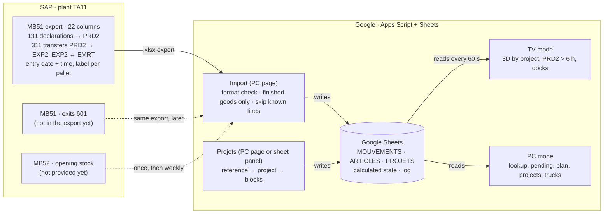
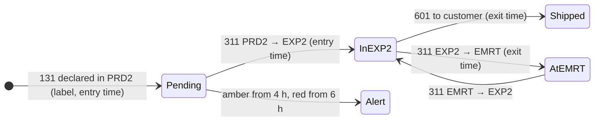

# EXP2 Digital Twin · WMS_exp_zone

A digital twin of the **EXP2 finished-goods warehouse**, built only with **Google Apps Script** (web app) and **Google Sheets** (database), fed by **SAP MB51 exports**. It shows on a wall TV and on office PCs what is in the warehouse, where, since when, which project it belongs to, what is still waiting in production (and for how many hours), and how full the racks and the shipping docks are.

**Status:** v2, the application reads the real MB51 export as SAP gives it (22 columns, entry date and time, one label number per pallet), groups the references by project (project names replace B1…B8 on every screen) and raises an alert when a pallet stays in PRD2 more than 6 hours (*v2 : format réel de l'export MB51, projets, alerte PRD2 > 6 h*). It is tested on an anonymised extract of the real export and runs a demo on simulated data in the same format. The code is in [`apps-script/src`](apps-script/), its install guide in [apps-script/README.md](apps-script/README.md), the tests in [`tests/`](tests/). Next: the exits (MvT 601) and the opening stock (MB52) in the data, then the calculation models to agree on (see [roadmap](#features-and-roadmap)).

| | |
|---|---|
| **Stack** | Google Apps Script (HtmlService web app) + Google Sheets. No server, no paid service. |
| **Input** | SAP MB51 export (131 declarations, 311 transfers; 601 exits when available), uploaded as is from the PC page **Import**. No live SAP link. |
| **Warehouse** | EXP2, about 1,600 m², 8 storage blocks (1,464 pallet places assumed), 8 shipping docks. |
| **Screens** | TV (3D view by project, key numbers, PRD2 waits, docks) and PC (lookup, pending, 2D plan, projects, trucks, import, simulation); two panels inside the sheet. |
| **Documents** | [Install and first use](apps-script/README.md) · [Architecture (v2 contract)](docs/ARCHITECTURE.md) · [v2 specification](docs/SPEC_V2.md) · [Implementation plan](docs/IMPLEMENTATION_PLAN.md) · [illustrated plan](https://claude.ai/artifact/43H2yDzvaYKBgpRcck7pvT) · [Sample data](sample-data/README.md) · [Real export, anonymised](sample-data/mb51-reel/README.md) |

---

## En bref (français)

- **Quoi :** un jumeau numérique de l'entrepôt d'expédition **EXP2**, sur Google Apps Script + Google Sheets uniquement.
- **Données :** l'export SAP **MB51** tel qu'il sort de SAP (22 colonnes) : déclarations de production 131 en PRD2, transferts 311 PRD2 → EXP2 et EXP2 ↔ EMRT, avec la date et l'heure de saisie et le numéro d'étiquette de chaque palette. Il est importé depuis la page PC **Import**. Pas de lien direct avec SAP.
- **Logique :** une étiquette = une palette. Déclarée mais pas encore en EXP2 = **en attente** (durée en heures) ; transférée en EXP2 = **en stock**, avec heure d'entrée, âge et bloc ; sortie (601 ou 311 vers EMRT) = **sortie**, avec heure de sortie. Seuls les **produits finis** (articles qui passent par EXP2) sont suivis.
- **Projets :** chaque référence appartient à un projet, chaque projet à un ou plusieurs blocs ; les noms de projet remplacent B1…B8 sur le plan, la vue 3D et la TV.
- **Alerte :** une palette en PRD2 depuis plus de **6 h** (orange dès 4 h) est signalée en rouge sur la TV et sur la page En attente.
- **Écrans :** une **TV** (vue 3D par projet, saturation des blocs, attente PRD2, quais et camions, alertes) et des **PC** (Jumeau 3D, recherche article, en attente, plan 2D, projets, quais & camions, import, simulation) ; dans le classeur, le panneau de contrôle et le panneau Projets & références.
- **État :** v2, testée sur un extrait anonymisé de votre export réel ; démonstration possible sur des données simulées au même format.
- **À faire maintenant :** demander à SAP les sorties 601 et le stock initial ([point 5](#5-ce-que-lexport-ne-contient-pas-encore)), affecter les références aux projets ([point 3](#3-affecter-les-références-aux-projets)), puis discuter ensemble des modèles de calcul.

### Premier usage

Le code s'installe une fois dans un Google Sheet ; ensuite tout se fait depuis le menu **EXP2 Jumeau** du classeur et depuis les pages PC. Détails techniques : [apps-script/README.md](apps-script/README.md).

#### 1. Installer ou mettre à jour

**Nouvelle installation**

1. Créez un Google Sheet, puis **Extensions › Apps Script**. Copiez-y les fichiers de [`apps-script/src`](apps-script/src) : avec `clasp push`, ou à la main, un fichier par fichier, avec exactement le même nom, y compris le fichier HTML `SidebarProjets` (nouveau en v2). Étapes détaillées : [apps-script/README.md](apps-script/README.md#install-in-a-new-google-sheet).
2. Rechargez le classeur, puis menu **EXP2 Jumeau › Installer / réinitialiser la base** : les onglets (dont `PROJETS`) et les deux clés d'accès sont créés.
3. Pour une démonstration : onglet **ACCUEIL › Générer 7 jours**. Une base simulée (données fictives) au format de l'export réel est créée et calculée : étiquettes, heures de saisie, 6 projets fictifs (ATLAS, BOREAL, CORSO, DELTA, ETNA, FJORD) avec leurs blocs, quelques palettes en attente depuis plus de 6 h. « Simuler +1 jour » ajoute la journée suivante.
4. Dans l'éditeur Apps Script : **Déployer › Nouveau déploiement › Application Web** (exécuter en tant que « Moi »). Copiez l'URL qui se termine par **/exec** (Déployer › Gérer les déploiements) et collez-la dans **EXP2 Jumeau › Panneau de contrôle › Liens**.
5. **EXP2 Jumeau › Ouvrir le jumeau** : le lien de l'écran **TV** (`?mode=tv&rotate=1`, à ouvrir en plein écran sur la TV) et les liens des **pages PC** (Jumeau 3D, Recherche article, En attente, Plan 2D, Projets, Quais & camions, Import SAP, Simulation).
6. Les **clés** s'affichent dans la même fenêtre : la clé **administrateur** (import, projets, simulation, recalcul) et la clé **quais** (page Quais & camions). Les pages PC la demandent une fois par session. Ne la communiquez qu'aux personnes concernées ; après une fuite : **EXP2 Jumeau › Régénérer les clés**. Les panneaux du classeur (contrôle, projets) ne demandent pas de clé : seuls les éditeurs du classeur peuvent les ouvrir.

**Mise à jour d'une base installée en v1**

1. Remplacez le code : `clasp push`, ou à la main en recopiant chaque fichier. **À la main, créez aussi le nouveau fichier** : **+ › HTML**, nom `SidebarProjets` (sans `.html`), et collez-y le contenu de `apps-script/src/SidebarProjets.html`.
2. Rechargez le classeur : le menu **EXP2 Jumeau** affiche maintenant « Projets & références ».
3. Menu **EXP2 Jumeau › Installer / réinitialiser la base**, répondez **NON** (« réparer seulement »). La base est migrée automatiquement, sans rien effacer ni déplacer :
   - nouvelles colonnes ajoutées **à la fin** de `MOUVEMENTS` (`Saisie le`, `Étiquette`, `Texte en-tête`, `Texte`, `Référence`, `Client`, `Commande client`), de `ARTICLES` (`Projet`) et des onglets `CALC_*` ;
   - onglet `PROJETS` créé après `ARTICLES` (`Projet`, `Blocs`, `Couleur`, `Commentaire`) ;
   - nouvelles lignes dans `PARAM_SEUILS` : `pendingHoursWarn` = 4, `pendingHoursCrit` = 6, `labelIsPallet` = 1, `importTrackedOnly` = 1, `trackAll` = 0.

   Les mouvements, le stock initial, les articles et le journal des imports sont conservés ; l'onglet ACCUEIL est refait et tout est recalculé. (Sans cette étape, la migration se fait d'elle-même au premier recalcul, import ou enregistrement de projets.)
4. Publiez le nouveau code de l'application Web : **Déployer › Gérer les déploiements › Modifier (crayon) › Version : Nouvelle version › Déployer**. L'URL `/exec` ne change pas ; sans cette étape, les écrans gardent l'ancienne version (pas de page Projets).
5. Les anciennes règles F1 à F5 de `REGLES_PLACEMENT` (commentaire « provisoire ») ne servent plus : le calcul les ignore tant qu'aucun article n'a ces familles, vous pouvez supprimer ces lignes. S'il reste une simulation v1 : **Simulation › Effacer la simulation**, ou **Générer 7 jours** pour une nouvelle démonstration au format réel.

#### 2. Importer l'export MB51 tel quel

1. Si des données simulées sont présentes : **EXP2 Jumeau › Simulation › Effacer la simulation**. Les lignes importées de SAP sont conservées, ainsi que les références et les projets enregistrés depuis la page ou le panneau Projets.
2. Dans SAP, exportez la liste MB51 comme d'habitude, sans la retravailler dans Excel (`.xlsx`, `.xls`, `.txt` texte avec tabulations, ou `.csv`). Les **22 colonnes de votre export** sont reconnues telles quelles : `Article`, `Division`, `Magasin`, `Code mouvement`, `Texte code mouvement`, `Stock spécial`, `Document article`, `Date comptable`, `Qté en unité saisie`, `UQ de saisie`, `Désignation article`, `Montant DI`, `Date de saisie`, `Heure de saisie`, `Nom de l'utilisateur`, `Texte d'en-tête pièce`, `Motif du mouvement`, `Texte`, `Référence`, `Client`, `Fournisseur`, `Commande client`. D'autres libellés de colonnes (français ou anglais) sont aussi reconnus.
3. Ouvrez la page PC **Import** et déposez le fichier. Rien n'est enregistré à ce stade. La page affiche :
   - « Format MB51 reconnu : 22 colonnes · heure de saisie ✓ · étiquettes ✓ (n) » ;
   - « n lignes gardées (produits finis) · n ignorées (n articles hors produits finis) » ;
   - le résultat de l'analyse par fichier (lues, valides, hors produits finis, doublons, rejetées) et les contrôles.
4. **Seuls les produits finis sont gardés** : les lignes en EXP2, et toutes les lignes des articles qui passent par EXP2 dans le fichier ou qui sont déjà suivis par le jumeau (listés dans l'onglet `ARTICLES`, ou déjà vus en EXP2). Le reste de l'export (pièces semi-finies consommées sur les lignes, matières premières entre EMRT et PRD2) est compté mais jamais enregistré. Sur l'extrait anonymisé de votre export : 4 157 lignes lues, **2 800 gardées**, **1 357 ignorées** (196 articles).
5. Pour tout garder quand même : cochez **« Importer aussi les articles hors produits finis »**. La case est décochée par défaut (`PARAM_SEUILS › importTrackedOnly` = 1). Même importés, ces articles ne sont calculés que si `PARAM_SEUILS › trackAll` = 1.
6. Cliquez sur **« Enregistrer dans la base (n lignes) »** et saisissez la clé administrateur (une fois par session). Le jumeau est recalculé une fois, à la fin ; l'onglet `IMPORT_LOG` garde une ligne par import.
7. **Réimporter le même fichier ajoute 0 ligne** : une ligne déjà connue est reconnue (Document article, Article, Magasin, MvT, quantité, date). Vos exports successifs peuvent donc se chevaucher de quelques jours.

Ce que l'import tire des colonnes :

- **Étiquette** (un numéro = un contenant = une palette) : le numéro du `Texte d'en-tête pièce` d'une déclaration 131 (`434514671|20261005010841` donne `434514671`), ou le `Texte` d'un transfert 311 scanné (`434505101`).
- **Saisie le** = `Date de saisie` + `Heure de saisie`, à la seconde, gardée telle que SAP la donne. Une saisie entre 00:00 et 01:59 est comptabilisée la veille (`Date comptable`) : c'est normal.
- **Quantité par palette** : celle de l'onglet `ARTICLES` quand elle est remplie, sinon apprise des étiquettes (la quantité la plus fréquente d'une étiquette de l'article ; la fiche article indique « apprise des étiquettes »).
- Les noms des utilisateurs sont enregistrés mais jamais affichés : les écrans montrent seulement **Auto** (scan BARFLOW, ADMINJOB) ou **Manuel**.

#### 3. Affecter les références aux projets

Sur la page PC **Projets** (clé administrateur pour enregistrer) :

1. **Coller des références** : collez une colonne copiée d'Excel (une référence par ligne), puis choisissez le projet dans « Projet (pour les lignes sans projet) » : la liste propose les projets existants, un nouveau nom crée le projet. Vous pouvez aussi coller deux colonnes copiées d'Excel, **Référence ⇥ Projet** (tabulation ou point-virgule entre les deux ; une ligne de titres « Référence », « Projet » est reconnue et ignorée) : le projet de la deuxième colonne passe avant celui du champ. « Sans projet » retire le projet. Une référence collée deux fois garde son dernier projet ; une ligne sans référence est ignorée ; une référence qui contient une espace, ou une ligne sans projet (ni deuxième colonne ni champ), est « Invalide ».
2. **Aperçu** : un tableau Référence · Désignation · Projet actuel · Nouveau projet · Statut (**Nouvelle**, **Changement**, **Inchangée**, **Invalide**). Une référence absente des données est marquée « jamais vue dans les données » : vérifiez le numéro. Rien n'est enregistré avant l'étape suivante.
3. **Enregistrer (n)** : le projet est écrit dans `ARTICLES › Projet` (une référence absente de `ARTICLES` y est ajoutée) et un nouveau projet est ajouté à l'onglet `PROJETS`, encore sans bloc. Le jumeau est recalculé.
4. **Zones par projet** : pour chaque bloc (B1 à B8, avec son libellé et sa capacité), ajoutez le ou les projets qui y sont rangés (un bloc peut servir à plusieurs projets), choisissez une couleur par projet (cliquez sur le carré de couleur ; « couleur auto » revient à la couleur automatique), regardez l'aperçu du plan, puis **Enregistrer les zones**. Le **plan 2D**, la **vue 3D** et la **TV** affichent alors le **nom des projets à la place de B1…B8** (le numéro du bloc reste écrit en petit) ; les palettes prennent la couleur de leur projet et sont placées dans les blocs de leur projet.
5. Les sections suivantes servent au suivi : **Projets** (références, palettes EXP2, en attente, > 6 h ; « Renommer » : un nom déjà pris fusionne les deux projets), **Références sans projet** (cochez, puis « Affecter à » un projet), **Toutes les références** (recherche, filtre par projet, changement du projet d'une ligne, puis « Enregistrer »).

**Depuis le classeur**, sans ouvrir l'application : menu **EXP2 Jumeau › Projets & références**. Un panneau s'ouvre à droite : la même zone « Coller des références » (« Aperçu », puis « Enregistrer »), la liste « Projets et blocs » (cliquez sur les blocs de chaque projet, « Ajouter » un projet, puis « Enregistrer les zones ») et le lien vers la page complète. Pas de clé : seuls les éditeurs du classeur y ont accès.

Bon à savoir :

- une référence sans projet est rangée dans les blocs qui n'ont aucun projet ; si tous les blocs ont un projet, ses palettes apparaissent « à placer » (alerte « n palettes sans projet à placer : aucun bloc libre (page Projets) »). L'alerte « n références suivies sans projet : affectez-les dans la page Projets » le rappelle ;
- une référence ajoutée à l'avance (pas encore vue dans les données) ne déclenche aucune alerte, même sans quantité par palette ;
- un nom de projet fait 40 caractères au plus, sans `,` `;` `|` ; « Sans projet » est réservé ;
- les onglets `ARTICLES` (colonne `Projet`) et `PROJETS` (`Blocs` = `B1, B7`, `Couleur` = `#rrggbb` ou vide) peuvent aussi être modifiés à la main, puis **Recalculer**.

#### 4. L'alerte PRD2 > 6 h

- **Ce qui compte :** une palette (étiquette) déclarée en PRD2 (131) et pas encore transférée en EXP2 (311).
- **Le temps d'attente** va de l'heure de saisie de la déclaration jusqu'à **l'heure des données** : la plus récente heure de saisie des lignes importées, pas l'heure qu'il est. Si le dernier import date d'hier soir, l'attente s'arrête à l'heure de cet export : importez régulièrement.
- **Couleurs :** orange (pré-alerte) à partir de **4 h**, rouge (alerte) à partir de **6 h**.
- **Réglage :** onglet `PARAM_SEUILS`, lignes `pendingHoursWarn` (4) et `pendingHoursCrit` (6) ; changez la valeur, puis **Recalculer**.
- **Où la voir :**
  - **TV** : la tuile « En attente PRD2 » affiche « dont > 6 h : n » en rouge et la plus ancienne attente ; le bandeau d'alertes commence par « n palettes en PRD2 depuis plus de 6 h · max … » ; la scène « En attente PRD2 » liste les étiquettes ; dans la vue 3D, les palettes en attente depuis plus de 6 h sont rouges.
  - **Page PC En attente** : une ligne par étiquette (Étiquette, Article, Désignation, Projet, Déclarée le, Attente, Saisie Auto/Manuel), la plus ancienne d'abord, en rouge au-delà de 6 h et en orange de 4 à 6 h ; en tête « n étiquettes en attente · n depuis plus de 6 h · plus ancienne … » à l'heure des données ; filtres par projet et par attente.
  - **Classeur** : onglet ACCUEIL, ligne « En attente PRD2 » (« PRD2 > 6 h : n ») ; onglet `CALC_EN_ATTENTE` (colonnes `Attente (h)` et `Niveau`).
- **Sur l'extrait de votre export** (heure des données : 05/10/2026 22:09) : 128 étiquettes en attente, **86 palettes depuis plus de 6 h**, 11 entre 4 et 6 h, la plus ancienne depuis 44 h 02. C'est le premier calcul sur données réelles : ces chiffres sont à confirmer avec le terrain.
- Les lignes sans heure de saisie (données d'avant la v2) suivent la règle en jours (`pendingDaysWarn`, 3 jours).

#### 5. Ce que l'export ne contient pas encore

- **Pas de sorties (MvT 601).** L'export ne contient que des déclarations (131) et des transferts (311). Sans les sorties vers les clients, EXP2 ne fait que se remplir : le stock et la saturation montent à chaque import, et il n'y a ni date de sortie ni durée de séjour. Sur l'extrait : 1 023 palettes en EXP2 au bout de deux jours, sans aucune sortie client.
- **Pas de stock initial (MB52).** Le jumeau part de zéro au premier jour de l'export : les palettes déjà en EXP2 avant cette date sont inconnues, et une sortie de ce stock ancien est comptée « sans stock connu » (une seule alerte orange : « … sorties sans stock connu : importez le stock initial (MB52) »). La page Import ne lit pas encore de fichier MB52 : c'est la prochaine étape côté application.
- **À demander à SAP** (ou à l'utilisateur clé) :
  1. la même sélection MB51 (division TA11, magasins PRD2, EXP2 et EMRT) **avec tous les types de mouvement**, en particulier les sorties **601** (et leurs annulations 602), dans la même mise en forme de 22 colonnes ;
  2. un **MB52** (stock par magasin) de EXP2, PRD2 et EMRT le matin du premier jour couvert par l'export, puis chaque semaine pour contrôler ;
  3. si possible, 60 à 90 jours d'historique MB51 avant le démarrage, pour donner une date d'entrée aux palettes déjà en stock ;
  4. en option, la colonne Magasin récepteur (UMLGO), et le Lot si les produits finis en ont un.

---

## Contents

1. [How it works](#how-it-works)
2. [Key concepts](#key-concepts)
3. [Screens](#screens)
4. [Features and roadmap](#features-and-roadmap)
5. [Repository structure](#repository-structure)
6. [Data (données)](#data-données)
7. [Data needed from SAP](#data-needed-from-sap)
8. [Development workflow](#development-workflow)
9. [Glossary](#glossary)

---

## How it works



1. Someone exports the MB51 list from SAP and drops it, unchanged, on the **Import** page.
2. Apps Script reads the file in the browser, recognises the columns, keeps the finished goods, skips lines already in the database, and recalculates the state of EXP2 once.
3. The references are given a project, and each project its blocks, on the **Projets** page (or in the sheet panel).
4. The TV and the PCs only read that small calculated state, so they stay fast. Every screen shows **« Données SAP jusqu'au … »** (the latest entry time of the data) so everyone knows how fresh the twin is.

## Key concepts

**Storage locations (Magasin):** `PRD2` = production · `EXP2` = our warehouse, the twin · `EMRT` = external warehouse.

**Pallet status**, derived only from SAP lines:



- **One label = one pallet.** The real export carries a container number (label) on each declaration (131, in `Texte d'en-tête pièce`) and on each scanned transfer (311, in `Texte`). The twin follows each label from PRD2 to EXP2 with its entry time. Quantities without a label (manual moves, opening stock) are counted as **virtual pallets**: quantity ÷ quantity per pallet, rounded up.
- **Times in hours.** `Saisie le` = entry date + entry time, as SAP gives it. Waits and ages are measured up to **the time of the data** (the latest entry time imported), not up to the current clock.
- **Matching.** A line with a label takes its own label first; otherwise entries and exits are matched **oldest first (FIFO)**, which gives every remaining quantity an entry time and, when it leaves, an exit time and dwell time.
- A **311 transfer is two SAP lines** with the same document number: minus in the storage location it leaves, plus in the one it enters. A labeled leg whose other leg is in a storage location outside the export is normal.
- **Reversals** (102, 132, 312, 602) cancel the latest posting of the same article.
- **Finished goods only:** the twin follows the articles that reach EXP2 (or are listed in `ARTICLES`); semi-finished parts and raw materials of the export are ignored.
- **Placement by project:** reference → project → blocks. The pallets of a project are spread over its blocks; the positions are descriptive (« théorique »), not a put-away instruction.

## Screens

| Screen | For | What it shows |
|---|---|---|
| **TV · overview** | Wall screen, no mouse | 3D warehouse with pallets colored by project and blocks named after their projects, pending pallets at the conveyor (red over 6 h), saturation per block, trucks at the 8 docks, key numbers (« En attente PRD2 … dont > 6 h »), alert ticker |
| **TV · other scenes** | Wall screen | 2D plan saturation, « En attente PRD2 » (one row per label, waits in hours), docks; the scenes rotate every 45 s |
| **PC · Jumeau 3D** | Office | The 3D (or isometric) view with its legend |
| **PC · Recherche article** | Office | One article: project, pallets in EXP2 / PRD2 / EMRT, quantity per pallet and its source, EXP2 labels with entry time and age, pending labels with their wait, exits with times, SAP lines, location |
| **PC · En attente** | Office | Labels declared in PRD2, not yet in EXP2, oldest first: red over 6 h, amber from 4 h, project filter |
| **PC · Plan 2D** | Office | Plan to scale colored by rack saturation, block tags with the project names; click a block to see its content |
| **PC · Projets** | Admin | Paste references and give them a project (preview, then save), zones per project, project list, references without project |
| **PC · Quais & camions** | Shipping team | The 8 docks: truck, status, loaded / planned pallets, dock staging saturation |
| **PC · Import** | Admin | Drop the MB51 export, see the recognised format, the finished-goods filter and the checks, save; import log |
| **PC · Simulation** | Admin | Generate or extend the demo data, download a simulated MB51 file to try the import, state and full alert list |
| **Sheet · Panneau de contrôle** | Sheet editors | Status, simulation parameters, links, access keys |
| **Sheet · Projets & références** | Sheet editors | The projects panel: paste references, blocks per project |

Mockups of the first screens are in the [illustrated plan](https://claude.ai/artifact/43H2yDzvaYKBgpRcck7pvT). Screenshots of the current screens are produced by `npm run e2e` in `tests/harness/out/shots/` (not committed).

## Features and roadmap

**Done:** the Apps Script application (phase 0a, v1), then v2: the real MB51 export read as is (22 columns, entry times, labels, finished-goods filter), one label = one pallet, waits in hours and the **PRD2 > 6 h** alert, **projects** (references → projects → blocks, project names on every screen, sheet panel), a simulator in the real format.

**Next:**

1. **Exits 601** in the export (same MB51 selection), so that EXP2 also empties and exit times exist.
2. **Opening stock**: one MB52 export, and the Import page made able to read it (the server function `api_importOpening` exists already).
3. **Calculation models to discuss together**, for example: how to count stock without a label (manual moves, opening stock); which day an entry belongs to (SAP posts the entries of 00:00–01:59 on the previous day); how several projects share one block and where references without a project go; which waits, thresholds and KPIs the TV must show.
4. Before go-live on real data: the period checkpoint (archive) of `MOUVEMENTS`, which grows by about 1,700 lines a day of the real export ([ARCHITECTURE section 12](docs/ARCHITECTURE.md#12-limits-and-growth)).

| Phase | Content | Status | Done when |
|---|---|---|---|
| **Phase 0a** | Demo on simulated data: load the sample database into a Google Sheet and deploy a read-only viewer (TV screen and article lookup, marked « DONNÉES SIMULÉES »); run it on the real TV hardware and the plant network (3D, CDN libraries, link access, Google banner); show it to the stakeholders. | Application ready; still to run on the real TV | Stakeholders have seen it on the real TV, and the 3D view and libraries work on the plant network. |
| **Phase 0b** | Clarify and approve: answer the questions of the plan, send real exports unmodified; site survey (real dimensions, block types and levels, real dock doors); IT approval of the Google account and of the link mode; list of stakeholders. | Real export received and read (v2); exits, opening stock, site survey and IT approval to come | Written IT approval, a validated capacity per block, and real files that import. |
| **Phase 1** | Data foundation: one movements table for all files, a global duplicate check, exits and opening stock required; the calculation engine, tested automatically; the import page with its checks, the freshness stamp, the import log; a one-page procedure in French. | Built and tested on the real format; waiting for exits and opening stock | EXP2 stock in the twin equals MB52, article by article. Re-uploading a file adds 0 lines. The test files give exactly their expected results. |
| **Phase 2** | PC: lookup, pending, saturation: pages Recherche article, En attente, Plan 2D; saturation per block and overall, positions labeled « théorique »; floor occupancy in m². | Pages built; floor occupancy not done | Any article found in under 10 s with its entry times. Block saturation matches a count of 2 blocks within ±5 %. |
| **Phase 3** | TV, 3D and docks: the 3D view from the `LAYOUT` tab, rotating TV scenes, automatic refresh, kiosk setup; the truck visit log on a tablet at the docks; the truck view and dock saturation. | Built; kiosk and dock pilot to do | The TV runs 5 working days unattended; over 90 % of truck visits are logged during a pilot week. |
| **Phase 4** | Placement rules: your rules, the position table, and the manual correction tool with its log; weekly physical checks during the pilot. | Placement by project done (v2); position table and correction tool not started | 2 blocks counted within ±5 %, and at least 90 % of sampled pallets in their predicted block. |
| **Phase 5** | Pilot, alerts, automation: two weeks in parallel with MB52 and spot checks; your thresholds, the alert list, replay of past days; automatic upload once the export layout is stable for 4 weeks; nightly backup and yearly archive. | PRD2 > 6 h alert done; the rest not started | The gap with MB52 stays under the agreed tolerance for 2 weeks, then one full week runs without manual upload. |

Full feature list, data requirements, risks and open questions: [docs/IMPLEMENTATION_PLAN.md](docs/IMPLEMENTATION_PLAN.md).

## Repository structure

```text
WMS_exp_zone/
├── README.md                       ← you are here
├── apps-script/
│   ├── README.md                   ← install, update from v1, real data, projects, tests
│   ├── .clasp.json.example         ← copy to .clasp.json at the repository root (rootDir: apps-script/src)
│   └── src/                        ← the Apps Script project, pushed as is by clasp (no sub-folder)
│       ├── appsscript.json         ← manifest
│       ├── Config.gs, Engine.gs, Normalize.gs, Simulation.gs   ← pure JavaScript (also run in Node tests and the browser)
│       ├── Repo.gs, Api.gs, Main.gs, Assets.gs                 ← sheet storage and migration, web app API, menu / ACCUEIL / panels
│       └── Index.html + Client, PageTv, PagesPc, Twin3d, Iso, Plan2d, Styles, Sidebar, SidebarProjets (.html)
├── docs/
│   ├── ARCHITECTURE.md             ← technical contract of the app, v2 (files, tabs, engine, API, state, web app)
│   ├── SPEC_V2.md                  ← v2 details: real MB51 format, labels, projects, 6 h alert
│   └── IMPLEMENTATION_PLAN.md      ← the full plan (data, logic, screens, phases, risks, questions)
├── tools/
│   └── mb51_reference.py           ← independent Python reference that writes sample-data/mb51-reel/expected.json
├── tests/
│   ├── *.test.js                   ← npm test: engine, normaliser, simulation, API, harness
│   └── harness/                    ← npm run harness / npm run e2e: every screen without Google, Playwright run, screenshots
└── sample-data/
    ├── README.md                   ← the three data sets
    ├── EXP2_twin_sample_db.xlsx    ← v1 simulated database (oracle), Google-Sheets-ready
    ├── csv/                        ← one CSV per tab (same content)
    ├── messy/                      ← messy SAP exports + expected import results
    └── mb51-reel/                  ← anonymised extract of the real MB51 export + expected results
```

## Data (données)

- **Demo data of the app.** **Générer 7 jours** (menu or ACCUEIL) runs the v2 simulator: 7 days ending yesterday, about 450 labels a day, fictional articles and 6 fictional projects, in the real 22-column format, with simulated 601 exits (the real export has none yet). Everything is invented and marked « DONNÉES SIMULÉES » on the screens.
- **Real export, anonymised** ([`sample-data/mb51-reel/`](sample-data/mb51-reel/README.md)). An extract of the real MB51 export of 04–05.10.2026 in its exact 22-column layout: every line of the 93 finished-goods articles (2,800) plus one line in 15 of the others (1,357). Operator names are replaced by `OPERATEUR01`…, the company name is removed from the header texts, amounts are set to 0. With `expected.json` (written by `tools/mb51_reference.py`): 2,800 lines kept and 1,357 dropped, data time 05.10.2026 22:09, 86 pallets in PRD2 for more than 6 h and 11 between 4 and 6 h, 1,023 pallets in EXP2.
- **v1 sample database** ([`sample-data/EXP2_twin_sample_db.xlsx`](sample-data/EXP2_twin_sample_db.xlsx), one CSV per tab in `csv/`). Two weeks of a fictional EXP2 (21.09 → 03.10.2026) in the first 12-column MB51 layout (no entry time, no label), with the expected results in the `CALC_*` tabs: state on 03.10.2026, 994 pallets in EXP2 (67.9 % of 1,464 places), 22 pallets pending in PRD2, 381 at EMRT. The v2 engine still reproduces it exactly. Open it in Google Sheets: Google Drive → New → File upload → right-click → Open with Google Sheets.
- **Messy exports** ([`sample-data/messy/`](sample-data/messy/README.md)): MB51 files with the usual export traps, and what the importer must find.

Details: [sample-data/README.md](sample-data/README.md).

## Data needed from SAP

| Data | Status |
|---|---|
| Production declarations (MB51, MvT 131 into PRD2) | have: real export (label and entry time on each line) |
| Transfers (MB51, MvT 311 / 312) | have: real export (label on the scanned lines) |
| Entry date and time (`Date de saisie`, `Heure de saisie`) | have |
| Container number (label) of each pallet | have, in `Texte d'en-tête pièce` (131) and `Texte` (311) |
| Exits (MB51, MvT 601 / 602 and any other issue out of EXP2) | **needed**: not in the export |
| Opening stock (MB52 of EXP2, PRD2, EMRT on the first day of the export, then weekly) | **needed** |
| 60–90 days of MB51 before go-live | needed |
| Export date-time and period of each file | partly: the time of the data is the latest entry time |
| Quantity per pallet, per article | optional for labeled articles (learned from the labels); needed for unlabeled stock |
| Project of each reference, blocks of each project | you enter them on the **Projets** page |
| Pallet type, height, stacking levels | needed |
| Site survey: real dimensions, block type (floor or rack), lanes × depth × levels, real dock doors | needed |
| Trucks at the docks (truck, dock, arrival, departure, planned and loaded pallets) | to confirm |
| Staging capacity in front of each dock | needed |
| Thresholds | PRD2 wait: 4 h / 6 h (your rule); saturation and the others: later |
| Site calendar: shifts, working days | to confirm (the export has postings on Sunday 04.10.2026) |
| SAP user IDs that are automatic interfaces | have: `BARFLOWTA11` (scan), `ADMINJOB` |
| Stakeholders and what each one needs to see | needed |

Columns still worth adding to the MB51 layout: **Magasin récepteur (UMLGO)** (the other side of a transfer on one line) and **Lot** if finished goods are batch-managed. `Poste` is not needed (lines are keyed without it).

## Development workflow

- Code lives in this repository (`apps-script/src`) and is pushed to the Apps Script project bound to the Google Sheet with [`clasp`](https://github.com/google/clasp) (`rootDir: apps-script/src`).
- One container-bound Apps Script project: the menu, the sheet panels, the simulation and the web app (TV + PC pages). Write actions are protected by two access keys (admin, docks). The web app keeps **one stable deployment URL** (`/exec`) that is updated in place (Déployer › Gérer les déploiements › Modifier › Nouvelle version).
- Tests run without Google (see [apps-script/README.md](apps-script/README.md#tests-and-local-harness-no-google-needed)): `npm test` runs **178 Node tests** in 5 files (normaliser 42, engine 43, API 62, simulation 22, harness 9), including the v1 oracle and the anonymised real export against `expected.json`; `npm run harness` builds every screen as a local page; `npm run e2e` runs **21 Playwright scenarios** over every screen (7 of them for v2: projects, the two sheet panels, waits in hours, TV alert, import of the real export, simulated MB51 file, generated simulation) and saves screenshots.
- Test data from the real export is anonymised: no file of the repository names the company or an operator.
- The spreadsheet and scripts belong to a **team Google account**, never a personal one. A nightly copy of the spreadsheet is kept in Drive.
- Work happens on feature branches; `main` holds what is deployed.

## Glossary

| Term | Meaning |
|---|---|
| **EXP2** | Our expedition / finished-goods warehouse (storage location), the subject of the twin |
| **PRD2** | Production storage location: declared pallets wait here (« en attente ») |
| **EMRT** | External warehouse |
| **TA11** | SAP plant (Division) |
| **MB51 / MB52** | SAP lists of material documents / of stock per storage location |
| **MvT** | SAP movement type (`Code mouvement`): 131 (or 101) declaration, 311 transfer, 601 shipment, 132 / 102 / 312 / 602 reversals |
| **Date cpt.** | Posting date (`Date comptable`); entries between 00:00 and 01:59 are posted on the previous day |
| **Saisie le** | Entry date + entry time of a SAP line (`Date de saisie` + `Heure de saisie`), to the second. « L'heure des données » = the latest one imported |
| **Étiquette** | Label: the container number (9 digits) of a pallet, scanned by BARFLOW; found in `Texte d'en-tête pièce` of a 131 and in `Texte` of a 311. One label = one pallet |
| **Projet** | The project a reference belongs to (`ARTICLES › Projet`); each project has its blocks and its color (`PROJETS`), and its name replaces B1…B8 on the screens |
| **Produits finis** | Finished goods: the articles that reach EXP2 (or are listed in `ARTICLES`), the only ones the twin follows |
| **PRD2 > 6 h** | A pallet declared in PRD2 and not yet transferred to EXP2 after 6 hours (`pendingHoursCrit`): red alert; amber from 4 h (`pendingHoursWarn`) |
| **Qté en unité saisie / UQ de saisie** | Quantity and unit of entry (PCE, KG…), short names Qté en UQS / UQS |
| **Quai d'expédition** | Shipping dock (8 docks, Q1–Q8) |
| **Virtual pallet** | For stock without a label: quantity ÷ quantity per pallet, rounded up |
| **FIFO** | First in, first out: exits consume the oldest entries first (a labeled exit takes its own label first) |
